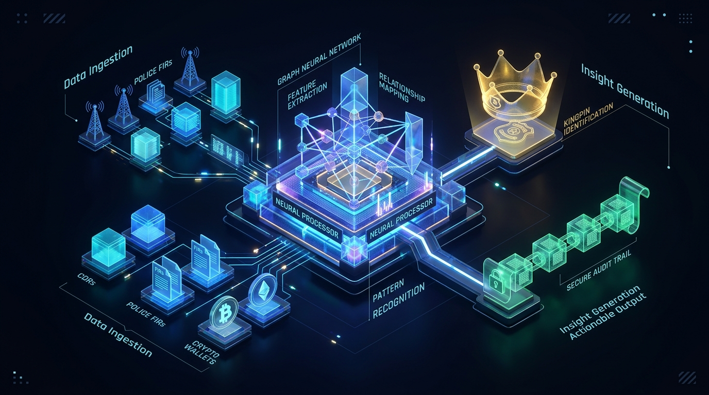
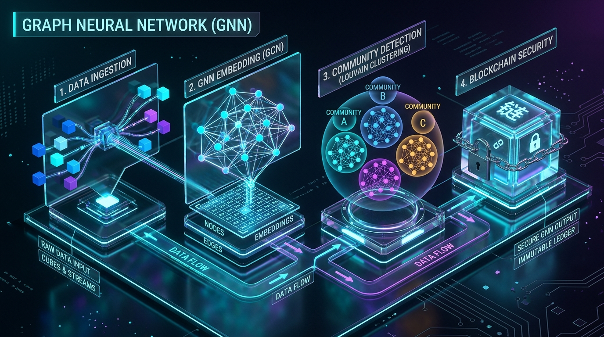
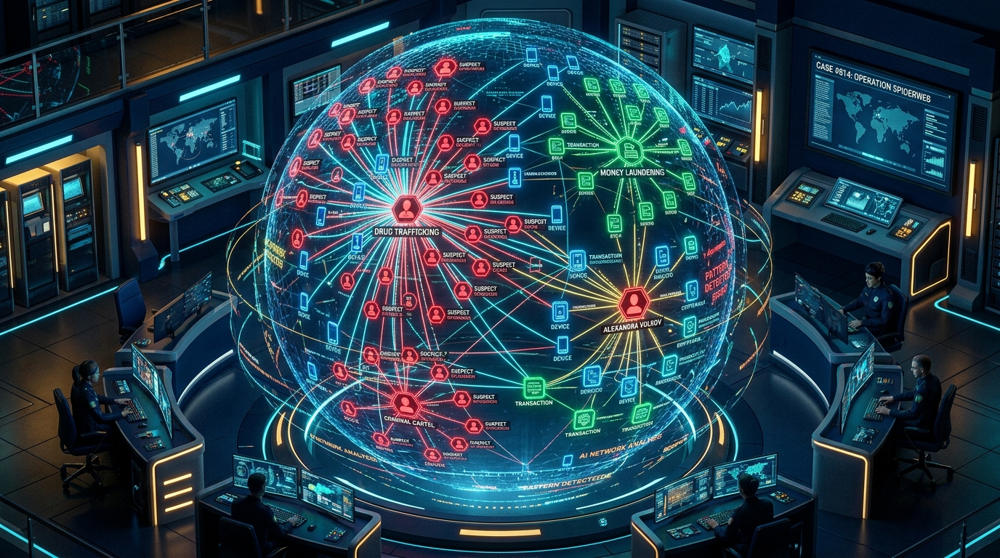
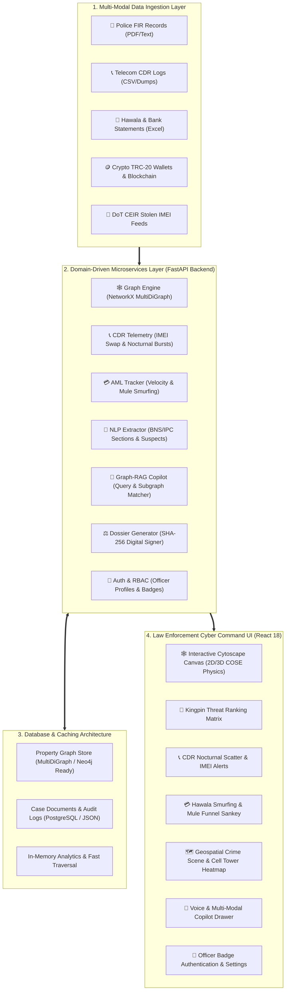
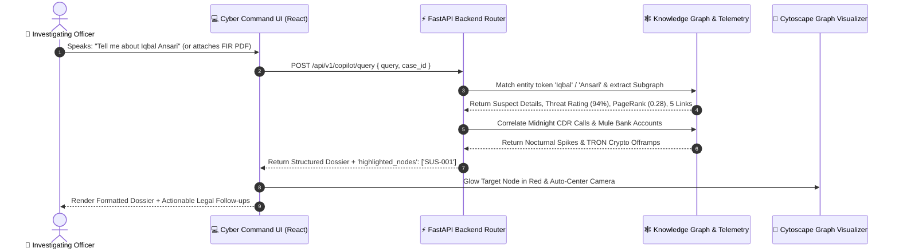
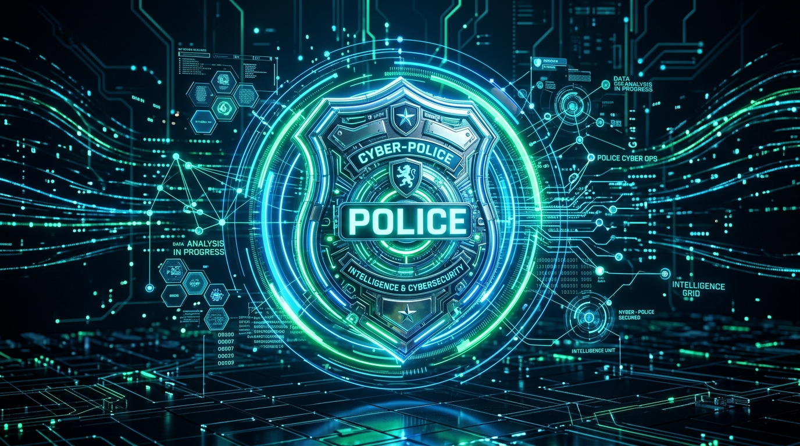
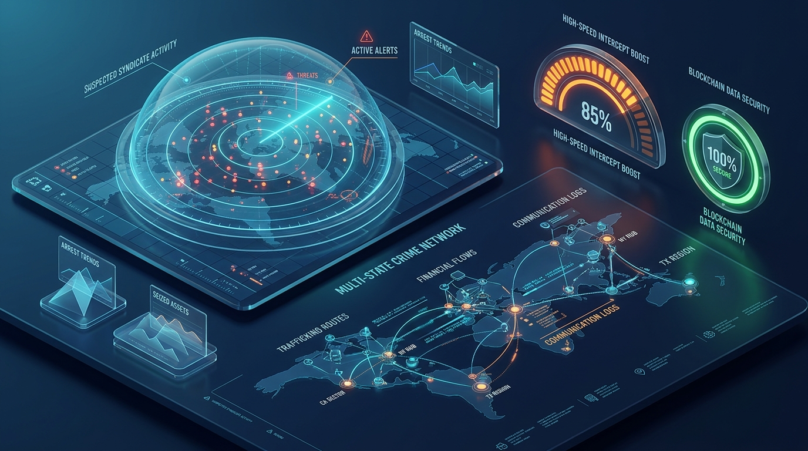
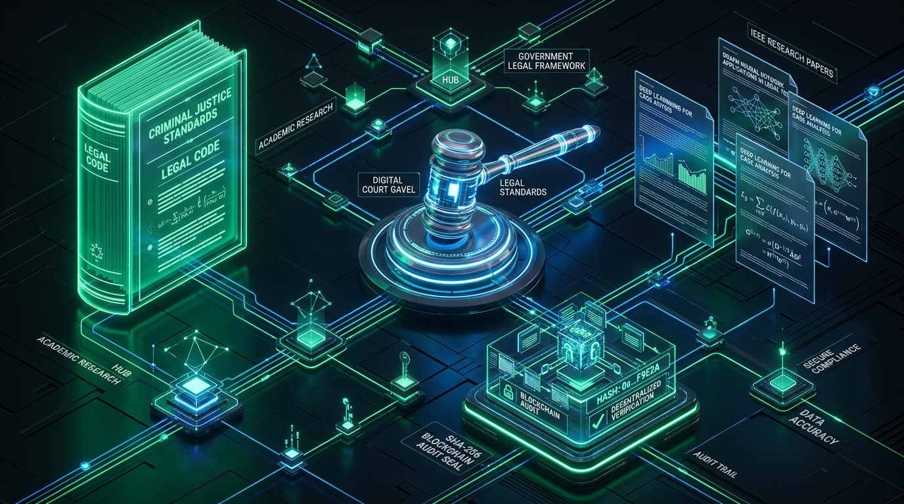

<div align="center">

# 🛡️ AI-POWERED CRIMINAL NETWORK ANALYSIS SYSTEM
### **Smart India Hackathon 2026 | Problem Statement: SIH26189**
**Theme:** Blockchain & Cybersecurity | **Organization:** Ministry of Home Affairs (MHA)

[](https://fastapi.tiangolo.com)
[](https://react.dev)
[](https://networkx.org)
[](https://cytoscape.org)
[](https://mha.gov.in)

<br/>



</div>

---

## 📌 Executive Summary

**AI-Powered Criminal Network Analysis System (KavachNet-AI)** is an enterprise, real-time intelligence and criminal syndicate de-anonymization platform designed for State Police Cyber Cells, the National Investigation Agency (NIA), and the Ministry of Home Affairs (MHA). 

It ingests unstructured Police First Information Reports (FIRs), multi-gigabyte Telecom Call Detail Records (CDR), Hawala financial transaction streams, and crypto wallet trails, transforming them into an interactive **Multi-Relational Knowledge Graph** powered by **Graph-RAG (Retrieval-Augmented Generation)**.

---

## 🚀 Key Innovations & System Capabilities

<div align="center">

| Module | Core Capability & Algorithmic Foundation | Legal / Real-World Impact |
| :--- | :--- | :--- |
| 👑 **Kingpin Radar** | Algorithmic **PageRank & Betweenness Centrality** calculations to unmask remote masterminds who do not handle physical contraband. | Pinpoints supreme syndicate directors across multi-state criminal cartels. |
| 📞 **CDR & Intercepts** | Telemetry analysis detecting **Nocturnal Call Bursts (1:00 AM – 4:00 AM)** and **IMEI Handset Swaps** across multiple burner SIM cards. | Uncovers burner phone infrastructure and safe-house communication cells. |
| 💳 **Mule & Hawala AML** | Financial pass-through velocity tracking (>80%) and money trail visualization routing to **TRON (TRC-20) USDT crypto offramps**. | Freezes layered bank accounts and flags cross-border crypto OTC desks. |
| 🤖 **AI Forensic Copilot** | **Graph-RAG Engine** with multi-modal input (Web Speech Voice Mic 🎙️, PDF/CSV/Photo file attachments `+`), and zero hallucination. | Generates real-time investigative dossiers with live bidirectional graph auto-focus. |
| ⚖️ **BSA 2023 Court Dossier** | One-click charge sheet brief generation with tamper-proof **SHA-256 digital signature certificate hashes**. | Fully admissible in courts of law under Bharatiya Sakshya Adhiniyam 2023. |
| 👮 **Officer Authentication** | Multi-role Law Enforcement Login (Superintendent, Cyber Analyst, Field IO) with badge verification and audit trails. | Enforces strict role-based access control (RBAC) and data isolation. |
| ⚙️ **Settings & Gateways** | Seamless integration configs for **DoT CEIR (Stolen IMEIs)**, **CCTNS/NATGRID (FIRs)**, and **FIU-India STRs**. | Bridges central national databases with local police investigation units. |

</div>

<br/>

<div align="center">
  
  
</div>

---

## 🏗️ System Architecture & Data Pipeline



---

## 🔄 Graph-RAG Interactive Query Workflow



---

## 🛠️ Complete Tech Stack

```
Frontend:
  ├── Framework: React 18 (Vite Bundler)
  ├── Styling: Tailwind CSS (Cyber Dark Theme)
  ├── Graph Engine: Cytoscape.js (COSE, Circle, Grid layouts)
  ├── Icons: Lucide React Icons
  └── Voice: Web Speech Recognition API

Backend (Microservices):
  ├── Framework: Python 3.10+ & FastAPI (Async ASGI)
  ├── Graph Computation: NetworkX (MultiDiGraph, PageRank, Louvain)
  ├── Server: Uvicorn High-Concurrency Worker
  ├── Data Validation: Pydantic V2 Schemas
  └── Security: SHA-256 Cryptographic Hash Signer (BSA 2023)

Data Integrations:
  ├── DoT CEIR Gateway: Stolen / Blacklisted IMEI Handset Lookup
  ├── CCTNS / NATGRID: Police e-FIR Feeds & Criminal Records
  └── Telecom CMS: Call Detail Records (CDR) & Cell Tower Coordinates
```

---

## 📸 3D Visual Assets & Architectural Renders

<div align="center">
  
  
  
</div>

---

## ⚡ Quick Start & Installation Guide

### Prerequisites
- **Python 3.10+**
- **Node.js 18+ & npm**
- **Git**

### 1. Clone the Repository
```bash
git clone https://github.com/mauryashivi199-ui/AI-Criminal-Network-Analysis-System.git
cd AI-Criminal-Network-Analysis-System
```

### 2. 1-Click Launch (Windows)
Double-click `start_system.bat` located in the root directory. It will automatically:
- Start the Python FastAPI backend on `http://localhost:8000`
- Start the React frontend on `http://localhost:5173`

---

### 3. Manual Step-by-Step Setup

#### Backend Setup
```bash
cd backend
python -m venv venv

# Windows Activate:
venv\Scripts\activate
# Linux/macOS Activate:
# source venv/bin/activate

pip install -r requirements.txt
python run_backend.py
```
> Backend API Swagger Documentation will be live at: `http://localhost:8000/docs`

#### Frontend Setup
```bash
cd frontend
npm install
npm run dev -- --host
```
> Frontend Application will be live at: `http://localhost:5173`

---

## 📱 Mobile & Local Wi-Fi Access

To view the platform on a physical mobile device or tablet:
1. Ensure your computer and phone are connected to the same Wi-Fi network.
2. Find your computer's IPv4 address (`ipconfig` in Command Prompt, e.g. `192.168.1.15`).
3. Open mobile browser and navigate to: `http://<YOUR_IP>:5173`
4. The mobile drawer, sticky bottom chat bar, and touch graph gestures will auto-adapt!

---

## ⚖️ Statutory & Legal Compliance

- **Bharatiya Sakshya Adhiniyam (BSA) 2023:** Complies with Section 63/65B requirements for electronic records integrity and chain-of-custody.
- **Information Technology Act, 2000:** Tamper-proof SHA-256 cryptographic certificate generation for electronic evidence.
- **Telecom Regulatory Standards:** Adheres to DoT CEIR handset blacklisting and Section 91 CrPC / BNSS CDR data schemas.

---

## 👥 Authors & Credits

- **Team:** SIH 2026 Finalists
- **Problem Statement ID:** SIH26189
- **Theme:** Blockchain & Cybersecurity
- **Ministry:** Ministry of Home Affairs (MHA), Government of India
- **Repository:** [AI-Criminal-Network-Analysis-System](https://github.com/mauryashivi199-ui/AI-Criminal-Network-Analysis-System)
